# Python
CURSO EM VIDEO PYTHON

* É uma linguagem de proposito geral
* Multiplataforma
* batteries inclded
* livre
* Orientada a objetos
* Muitas bibliotecas

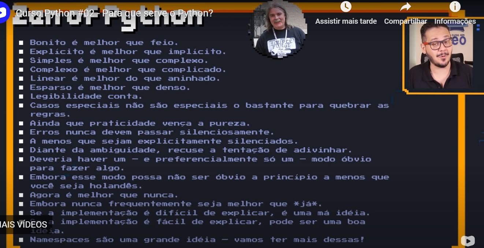

# Principais áreas
* Inteligência Artificial
* Biotecnolgia
* Computação 3D

# Quem usa Python
* ZOPE
* Air Canada
* BitTorrent
* Globo
* Google
* YouTube
* Nasa
* Industrial Light&Magic
* AutoDesk

# Tipos Primitivos e Saidas de Dados
* int()➡ tudo dentro do parentese é número inteiro
* float()➡ número reais
* bool()➡ valores lógicos ou booleanos
* str()➡ valores caractere ou strings

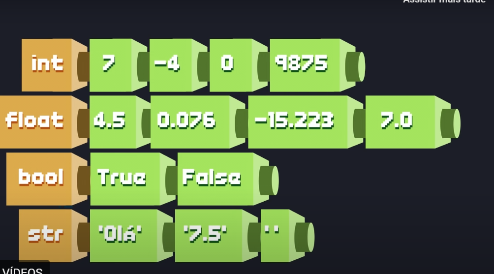
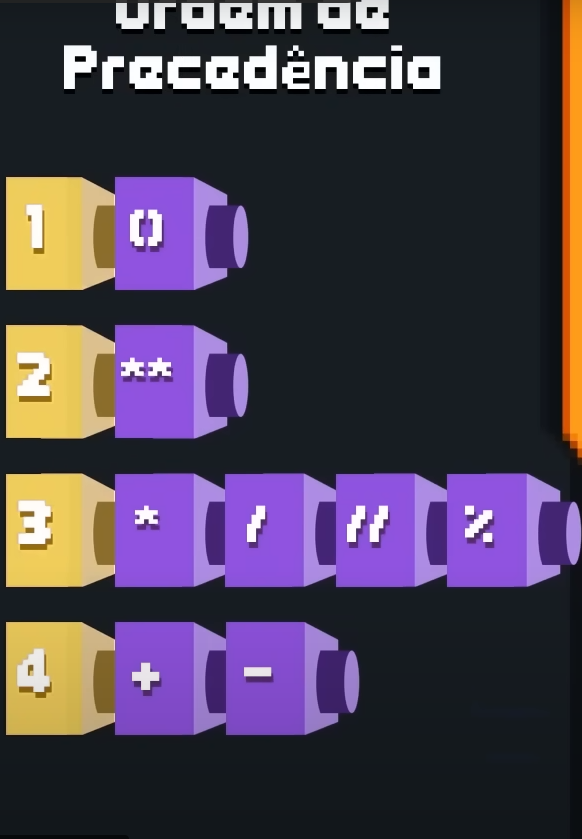

# Operadores Aritiméticos
* Adição ➡ +
* Subtração ➡ -
* Multiplicação ➡ *
* Divisão ➡ /
* Potência ➡ **
* Divisão Inteira ➡ //
* Resto da Divisão ➡ %

+ Ordem de Precedência
* Parêntese ➡ ()
* Exponenciação ➡ **
* Multiplicação, divisão, divisão inteira, resto da divisão.
* Adição e Subtração
=======
# trabalhando com Módulos
* import nome-do-modulo
para importar somente uma função do modulo
* from nome-modulo import nome-função

* ou pip install nome-do-modulo

# Manipulando cadeias de texto

* Fatiamento
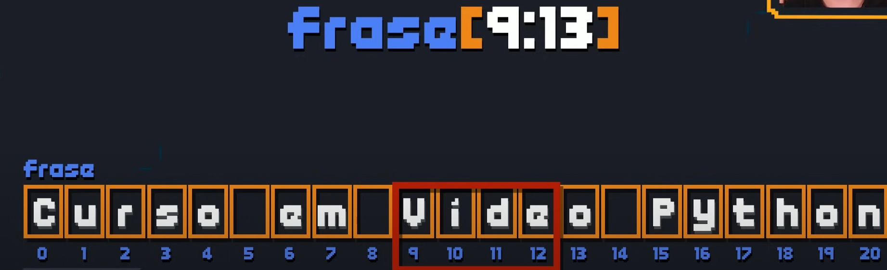

* Analise
frase = 'Curso em video Python'

len(frase) --> espaço ou tamanho
frase.count('o') --> contar as vezes que aparece o caractere
frase.find('deo') --> encontrar o caractere
frase.find('Android') --> quando colocar string que nao existe, recebe valor -1
'Curso' in frase --> existe a palavra curso na frase 

* Transformação

frase.replace('Python', 'Android') --> Troca a primeira palavra pela segunda
frase.upper() --> transforma os caracteres em maiusculos
frase.lower() --> transforma os caracteres em minusculas
frase.captalize() --> coloca somente o primeiro caractere em maiusculo 
frase.title() --> transforma o primeiro caractere de cada palavra na string em maiusculo
frase.strip() --> remove todos os espaços inuteis da string
frase.rstrip() --> remove somente os ultimos espaços
frase.lstrip() --> remove somente os primeiros espaços

* Divisão

frase.split() --> divide os espaços da string, cada palavra recebe uma indexação nova

* Junção

'-'.join(frase) --> juntar a string que foi separada

# Condições 

* Condições Simples e compostas
--> Em uma condição, ou um bloco verdadeiro é executado, ou um bloco falso é executado
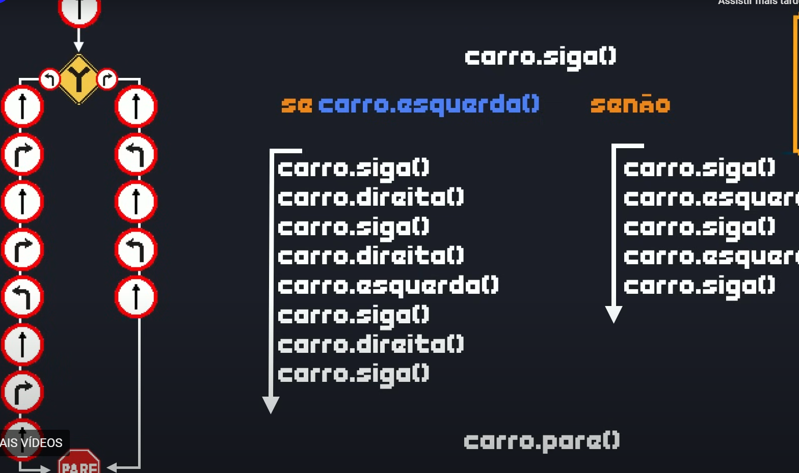
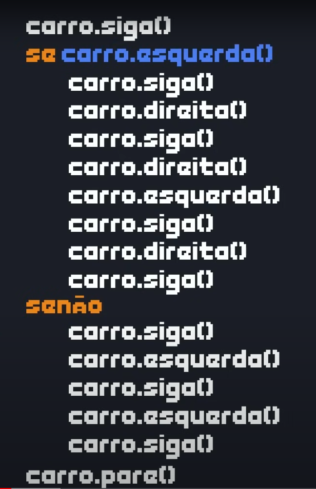
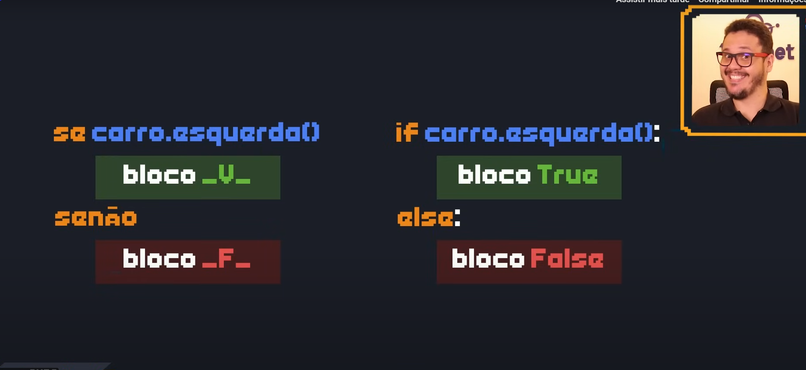

# Aula Extra Mundo 1 - Como colocar cores no terminal

* ANSI escape sequence 

\033[stilo;texto;fundom
\033{0;33;44m

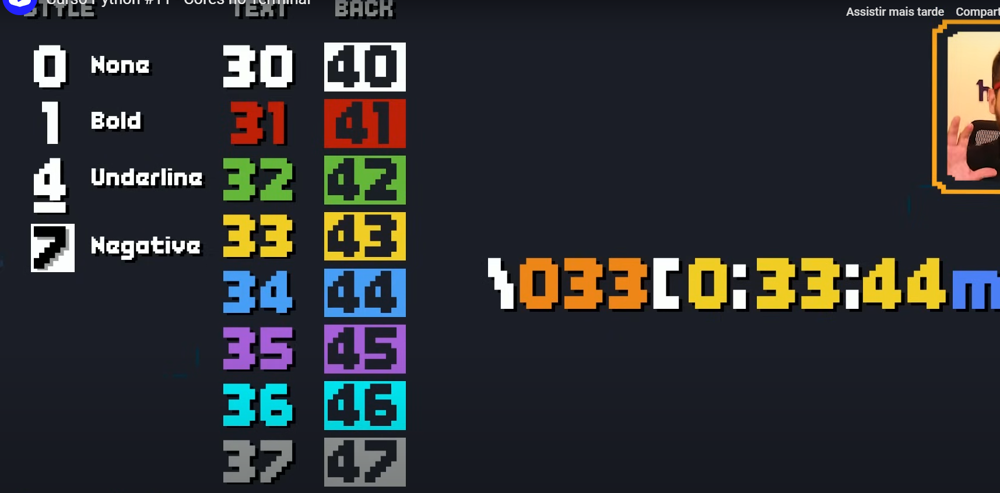
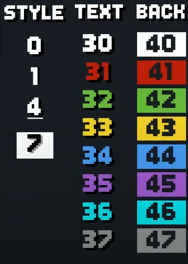

# Condições aninhadas
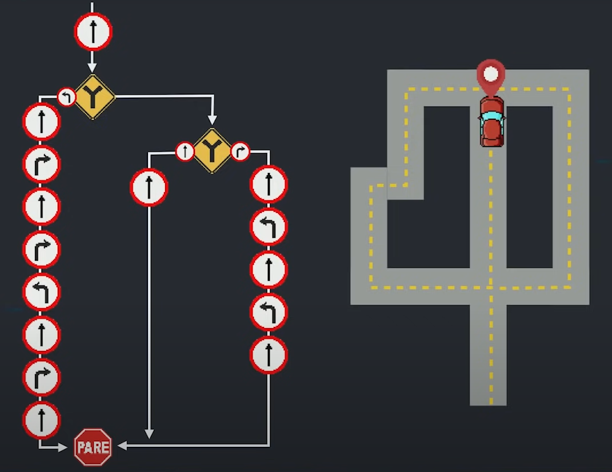

# LAÇOS DE REPETIÇÂO
aula13
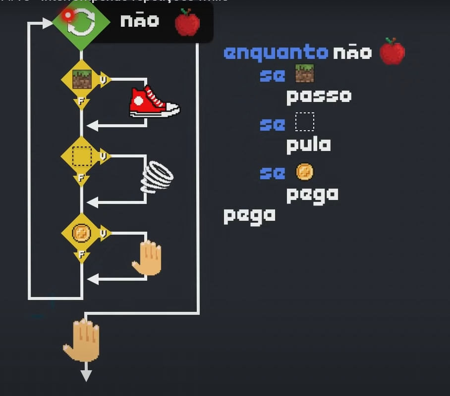

